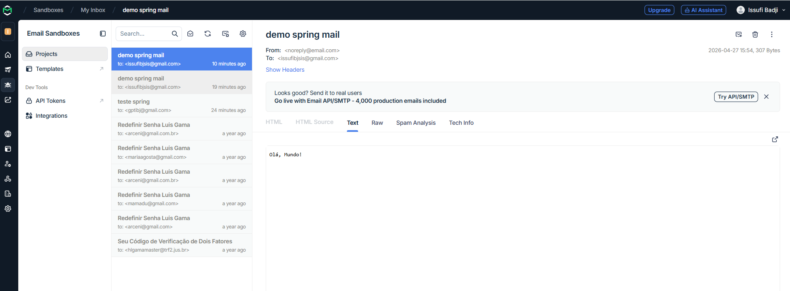

<h1 align="center">
  Email Spring Boot
</h1>

<p align="center">
 
 
</p>

 Enviou e-mails de forma simples e eficaz utilizando o poderoso framework Spring Boot em conjunto com a biblioteca JavaMail.

## Demo

<p align="center">
  
</p>

## Tecnologias
 
- [Spring Boot](https://spring.io/projects/spring-boot)
- [Spring MVC](https://docs.spring.io/spring-framework/reference/web/webmvc.html)
- [Spring Email](https://docs.spring.io/spring-framework/reference/integration/email.html)

## Como Executar

- Clonar repositório git:
  ```
  git clone https://github.com/issufibadji/email-springboot.git
  ```

- Construir o projeto:
  ```
  ./mvnw clean package
  ```

- Configurar credenciais do servidor de email

- Executar:
  ```
  java -jar ./target/email-springboot-0.0.1-SNAPSHOT.jar
  ```

- Testar ( com [httppie](https://httpie.io) ):

  ```
  http POST :8080/email to="issufibjsis@gmail.com" subject="demo spring mail" body="Olá, Mundo"
  ```
  mas antes instala:
  ```
   pip install httpie
 ```
ou
  ```
  Invoke-WebRequest -Uri http://localhost:8080/email -Method POST -ContentType "application/json" -Body '{"to":"gptibj@gmail.com","subject":"teste spring","body":"funcionou!"}'
  ```
